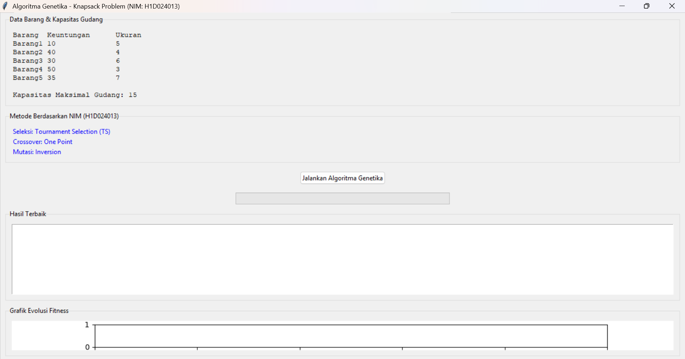

# Praktikum Algoritma Genetika – Knapsack Problem

**NIM:** H1D024013  
**Nama:** Melysa Ayu Wulan Sari

---

## 📌 Deskripsi Tugas

Menyelesaikan **Knapsack Problem** (masalah pemilihan barang dengan kapasitas maksimal gudang) menggunakan **Algoritma Genetika**.  
Pemilik toko ingin memilih barang yang memberikan keuntungan maksimal tanpa melebihi kapasitas gudang.

---

## 📊 Data Barang & Kapasitas

| Barang  | Keuntungan | Ukuran |
|---------|------------|--------|
| Barang1 | 10         | 5      |
| Barang2 | 40         | 4      |
| Barang3 | 30         | 6      |
| Barang4 | 50         | 3      |
| Barang5 | 35         | 7      |

**Kapasitas Maksimal Gudang:** 15

---

## 🧬 Parameter Algoritma Genetika (berdasarkan NIM)

Dua digit terakhir NIM = **13**  
- Digit pertama (1) → **Seleksi: Tournament Selection (TS)**  
- Digit kedua (3) → **Crossover: One Point**  
- Jumlah digit (1+3=4) → **Mutasi: Inversion**

| Parameter         | Nilai                         |
|-------------------|-------------------------------|
| Populasi          | 50                            |
| Generasi          | 100                           |
| Probabilitas crossover | 0.8                       |
| Probabilitas mutasi   | 0.05                      |
| Elitisme          | 2 (individu terbaik langsung lolos) |

---

## 🖥️ Cara Menjalankan Program

1. **Pastikan Python terinstal** (disarankan versi 3.7+).
2. **Install library matplotlib** jika belum:
   ```bash
   pip install matplotlib
3. **Jalankan program:** genetic_knapsack py
    Klik tombol "Jalankan Algoritma Genetika" – program akan berjalan otomatis.
    Hasil akan muncul di bagian bawah, lengkap dengan grafik evolusi fitness.

---

## 📈 Hasil Output (Contoh dari Program)
Setelah menjalankan program, diperoleh solusi terbaik sebagai berikut:
    Solusi terbaik:
    Barang terpilih: Barang2, Barang4, Barang5
    Total Keuntungan: 125
    Total Ukuran: 14 / 15
    Berikut tampilan GUI program beserta grafik fitness:



**Penjelasan:**
Barang2 (profit 40, ukuran 4)
Barang4 (profit 50, ukuran 3)
Barang5 (profit 35, ukuran 7)
Total profit = 40+50+35 = 125, total ukuran = 4+3+7 = 14 (masih dalam kapasitas 15).

**Grafik Evolusi Fitness**
Garis hijau (Best Fitness): nilai fitness terbaik tiap generasi.
Garis oranye (Avg Fitness): rata-rata fitness populasi tiap generasi.
Terlihat bahwa fitness meningkat seiring generasi hingga mencapai maksimum 125.

---

## 📁 Struktur Repositori
text
H1D024013-PraktikumKB-Pertemuan10/
├── genetic_knapsack.py      # Source code utama
├── gui.png                  # Screenshot hasil eksekusi
└── README.md                # Penjelasan 

---

## 🧾 Kesimpulan
Algoritma Genetika dengan parameter yang sesuai NIM berhasil menemukan kombinasi barang optimal: Barang2, Barang4, Barang5 dengan keuntungan 125 dan total ukuran 14. Program juga menampilkan grafik peningkatan fitness secara visual.